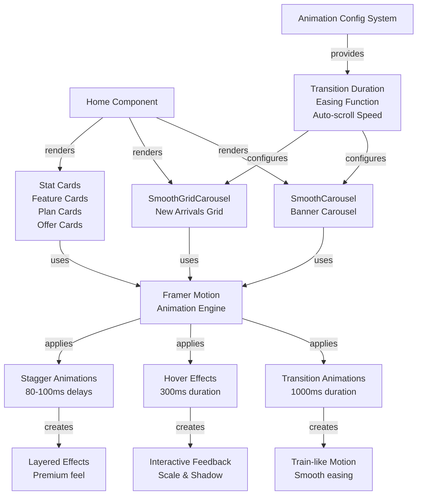
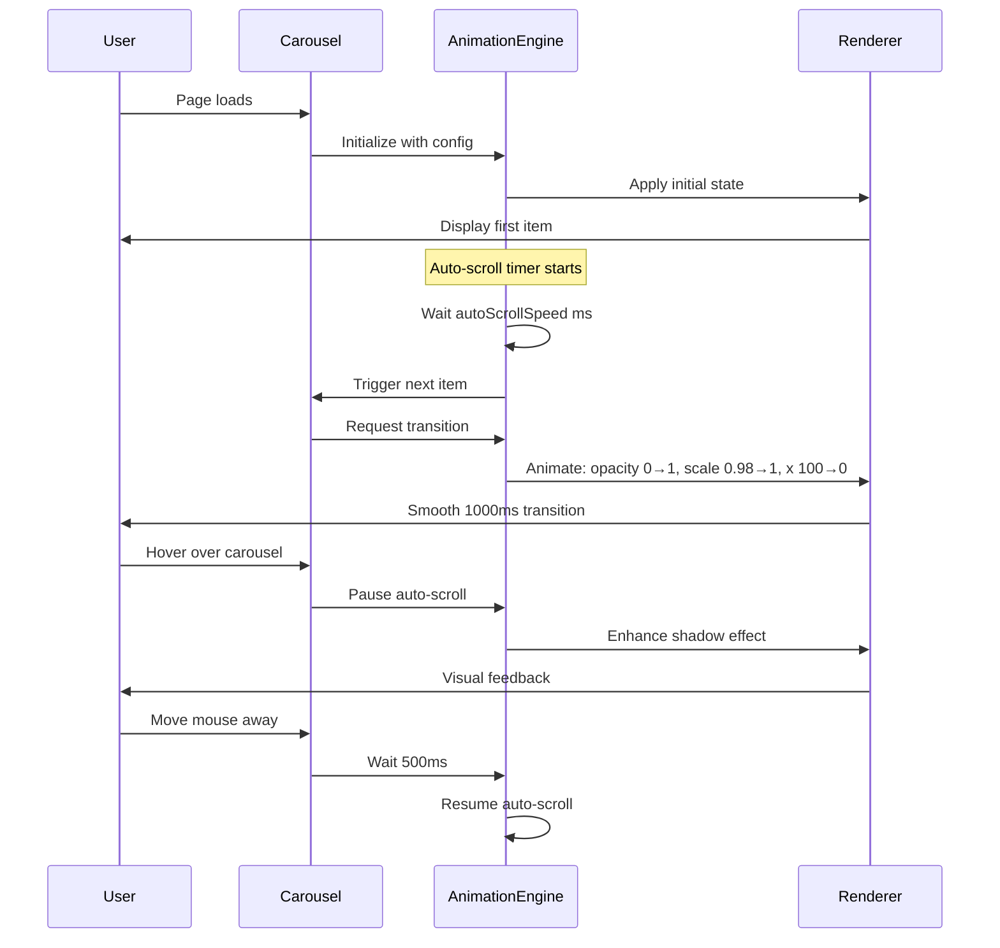

# Design Document: Smooth Carousel Animations

## Overview

This design document provides comprehensive technical guidance for implementing smooth, train-like carousel animations in the Jewel Scheme app. The design combines high-level system architecture with low-level implementation details, covering the SmoothCarousel (banner carousel), SmoothGridCarousel (new arrivals grid), and Home component enhancements. The animations create a premium, luxurious experience for jewelry customers through continuous smooth motion, impressive visual effects, and responsive behavior across all devices.

**Key Design Principles:**
- Train-like continuous motion with 1000ms transitions
- Premium gold/brown color scheme (#c89b3c, #e0b254, #3e2b16)
- Smooth easing with cubic-bezier(0.4, 0, 0.2, 1)
- Staggered animations for layered visual effects
- Full accessibility and performance optimization
- Responsive across mobile, tablet, laptop, and desktop

---

## Architecture Overview



---

## System Architecture

### Component Hierarchy

```
Home Component
├── SmoothCarousel (Banner)
│   ├── AnimatePresence (Framer Motion)
│   ├── Motion.div (Item Container)
│   ├── Navigation Buttons (Prev/Next)
│   └── Dot Indicators
├── Stat Cards (Staggered)
├── SmoothGridCarousel (New Arrivals)
│   ├── AnimatePresence (Framer Motion)
│   ├── Motion.div (Grid Container)
│   ├── Motion.div (Grid Items - Staggered)
│   ├── Navigation Buttons (Prev/Next)
│   └── Dot Indicators
├── Feature Cards (Staggered)
├── Plan Cards (Staggered)
└── Offer Cards (Staggered)
```

### Animation Flow Diagram



---

## High-Level Design: System Diagrams

### Animation State Machine

```
┌─────────────────────────────────────────────────────────────┐
│                    CAROUSEL STATE MACHINE                   │
├─────────────────────────────────────────────────────────────┤
│                                                              │
│  ┌──────────────┐                                           │
│  │   IDLE       │ (Waiting for auto-scroll timer)           │
│  │ (Playing)    │                                           │
│  └──────┬───────┘                                           │
│         │ autoScrollSpeed ms elapsed                        │
│         ↓                                                    │
│  ┌──────────────┐                                           │
│  │ TRANSITIONING│ (1000ms smooth animation)                 │
│  │ (Animating)  │                                           │
│  └──────┬───────┘                                           │
│         │ transition complete                               │
│         ↓                                                    │
│  ┌──────────────┐                                           │
│  │   IDLE       │ (Back to waiting)                         │
│  │ (Playing)    │                                           │
│  └──────┬───────┘                                           │
│         │ user hovers / clicks button                       │
│         ↓                                                    │
│  ┌──────────────┐                                           │
│  │   PAUSED     │ (Auto-scroll stopped)                     │
│  │ (Not Playing)│                                           │
│  └──────┬───────┘                                           │
│         │ 500ms / 3000ms inactivity                         │
│         ↓                                                    │
│  ┌──────────────┐                                           │
│  │   IDLE       │ (Resume auto-scroll)                      │
│  │ (Playing)    │                                           │
│  └──────────────┘                                           │
│                                                              │
└─────────────────────────────────────────────────────────────┘
```

### Responsive Breakpoints

```
Mobile (< 640px)          Tablet (640-1024px)      Laptop (1024-1280px)    Desktop (> 1280px)
┌──────────────────┐      ┌──────────────────┐     ┌──────────────────┐    ┌──────────────────┐
│ 1 item per row   │      │ 2 items per row  │     │ 3 items per row  │    │ 4 items per row  │
│ Full width       │      │ Optimized gap    │     │ Balanced layout  │    │ Maximum content  │
│ Touch-friendly   │      │ Tablet optimized │     │ Laptop optimized │    │ Desktop optimized│
│ Reduced effects  │      │ Standard effects │     │ Full effects     │    │ Full effects     │
└──────────────────┘      └──────────────────┘     └──────────────────┘    └──────────────────┘
```

### Visual Effects Hierarchy

```
┌─────────────────────────────────────────────────────────────┐
│                  VISUAL EFFECTS HIERARCHY                   │
├─────────────────────────────────────────────────────────────┤
│                                                              │
│  Level 1: Core Motion (Always Applied)                      │
│  ├─ Opacity transition (0 → 1)                              │
│  ├─ Scale transition (0.98 → 1.0)                           │
│  └─ Position transition (x: 100px → 0px)                    │
│                                                              │
│  Level 2: Depth Effects (Desktop & Tablet)                  │
│  ├─ Shadow enhancement (0 22px 48px → 0 28px 56px)         │
│  ├─ Subtle rotation (0° → 0.5°)                             │
│  └─ Border-radius animation                                 │
│                                                              │
│  Level 3: Premium Polish (Desktop Only)                     │
│  ├─ Glow effects on active items                            │
│  ├─ Breathing animation on idle elements                    │
│  └─ Advanced gradient shifts                                │
│                                                              │
│  Level 4: Reduced Motion (Accessibility)                    │
│  ├─ Instant transitions (no animation)                      │
│  ├─ No visual effects                                       │
│  └─ Functional only                                         │
│                                                              │
└─────────────────────────────────────────────────────────────┘
```

---

## Low-Level Design: Implementation Details

### Animation Configuration System

```typescript
// Core animation configuration interface
interface AnimationConfig {
  // Transition timing
  transitionDuration: number;        // 800-1200ms (default: 1000ms)
  easingFunction: string | number[]; // cubic-bezier or preset
  
  // Auto-scroll behavior
  autoScrollSpeed: number;           // 2000-10000ms
  autoScrollEnabled: boolean;        // true/false
  
  // Pause behavior
  pauseOnHover: boolean;             // true/false
  pauseOnHoverDuration: number;      // 500ms
  pauseOnClickDuration: number;      // 3000ms
  
  // Responsive behavior
  itemsPerRow: {
    mobile: number;    // < 640px: 1
    tablet: number;    // 640-1024px: 2
    laptop: number;    // 1024-1280px: 3
    desktop: number;   // > 1280px: 4
  };
  
  // Visual effects
  enableShadowEffects: boolean;      // true/false
  enableScaleEffects: boolean;       // true/false
  enableStaggerAnimation: boolean;   // true/false
  staggerDelay: number;              // 80-100ms
  
  // Performance
  enableGPUAcceleration: boolean;    // true/false
  reduceMotionEnabled: boolean;      // respects prefers-reduced-motion
}

// Default configuration
const DEFAULT_CONFIG: AnimationConfig = {
  transitionDuration: 1000,
  easingFunction: [0.4, 0, 0.2, 1],  // cubic-bezier
  autoScrollSpeed: 5000,              // Banner: 5s, Grid: 6s
  autoScrollEnabled: true,
  pauseOnHover: true,
  pauseOnHoverDuration: 500,
  pauseOnClickDuration: 3000,
  itemsPerRow: { mobile: 1, tablet: 2, laptop: 3, desktop: 4 },
  enableShadowEffects: true,
  enableScaleEffects: true,
  enableStaggerAnimation: true,
  staggerDelay: 80,
  enableGPUAcceleration: true,
  reduceMotionEnabled: false,
};
```

### Framer Motion Animation Specifications

#### Main Carousel Transition

```typescript
// SmoothCarousel item animation
const carouselItemVariants = {
  initial: {
    opacity: 0,
    x: 100,
    scale: 0.98,
  },
  animate: {
    opacity: 1,
    x: 0,
    scale: 1,
  },
  exit: {
    opacity: 0,
    x: -100,
    scale: 0.98,
  },
};

const carouselTransition = {
  duration: 1.0,                    // 1000ms
  ease: [0.4, 0, 0.2, 1],          // cubic-bezier
};

// Applied to motion.div
<motion.div
  initial="initial"
  animate="animate"
  exit="exit"
  variants={carouselItemVariants}
  transition={carouselTransition}
/>
```

#### Grid Carousel Staggered Animation

```typescript
// SmoothGridCarousel container animation
const gridContainerVariants = {
  initial: { opacity: 0, x: 100 },
  animate: { opacity: 1, x: 0 },
  exit: { opacity: 0, x: -100 },
};

const gridContainerTransition = {
  duration: 1.0,
  ease: [0.4, 0, 0.2, 1],
};

// SmoothGridCarousel item animation (staggered)
const gridItemVariants = {
  initial: { opacity: 0, y: 20, scale: 0.95 },
  animate: { opacity: 1, y: 0, scale: 1 },
};

const gridItemTransition = {
  duration: 0.6,
  ease: [0.4, 0, 0.2, 1],
};

// Applied with stagger
<motion.div
  variants={gridItemVariants}
  transition={{
    ...gridItemTransition,
    delay: index * 0.1,  // 80-100ms stagger
  }}
/>
```

#### Hover Effects

```typescript
// Navigation button hover
whileHover={{
  scale: 1.15,
  boxShadow: '0 12px 32px rgba(200, 155, 60, 0.25)',
}}

// Dot indicator hover
whileHover={{
  scale: 1.3,
}}

// Grid item hover
whileHover={{
  y: -8,
  boxShadow: '0 20px 40px rgba(133, 104, 74, 0.2)',
  transition: { duration: 0.3 }
}}

// Tap feedback
whileTap={{
  scale: 0.96,
}}
```

### Component Implementation Structure

#### SmoothCarousel Component

```typescript
interface SmoothCarouselProps {
  items: any[];                    // Array of carousel items
  renderItem: (item: any, index: number) => React.ReactNode;
  itemsPerView?: number;           // Default: 1
  autoScroll?: boolean;            // Default: true
  autoScrollSpeed?: number;        // Default: 5000ms
  gap?: number;                    // Default: 16px
  height?: string;                 // Default: 'auto'
  onItemClick?: (item: any, index: number) => void;
  showControls?: boolean;          // Default: true
  infinite?: boolean;              // Default: true
}

// State management
const [currentIndex, setCurrentIndex] = useState(0);
const [isAutoScrolling, setIsAutoScrolling] = useState(autoScroll);
const [isHovering, setIsHovering] = useState(false);
const autoScrollTimer = useRef(null);

// Key behaviors
- Auto-scroll: Advances one item every autoScrollSpeed ms
- Pause on hover: Stops auto-scroll, resumes after 500ms
- Manual navigation: Buttons pause auto-scroll, resume after 3000ms
- Infinite loop: Wraps around to beginning when reaching end
- Smooth transitions: 1000ms cubic-bezier easing
```

#### SmoothGridCarousel Component

```typescript
interface SmoothGridCarouselProps {
  items: any[];                    // Array of grid items
  renderItem: (item: any, index: number) => React.ReactNode;
  itemsPerRow?: number;            // Default: 4
  autoScroll?: boolean;            // Default: true
  autoScrollSpeed?: number;        // Default: 6000ms
  gap?: number;                    // Default: 16px
  onItemClick?: (item: any, index: number) => void;
  showControls?: boolean;          // Default: true
  infinite?: boolean;              // Default: true
}

// Responsive behavior
- Mobile (< 640px): 1 item per row
- Tablet (640-1024px): 2 items per row
- Laptop (1024-1280px): 3 items per row
- Desktop (> 1280px): 4 items per row

// Key behaviors
- Grid pagination: Advances by itemsPerView items
- Staggered animations: Each item delays by 80ms
- Responsive resize: Smoothly adapts to new layout
- Smooth transitions: 1000ms cubic-bezier easing
```

#### Home Component Enhancements

```typescript
// Hero section
- Fade-in animation on load (0.8s)
- CTA button hover effect (scale 1.05, shadow enhancement)
- Smooth transitions on all properties

// Stat cards
- Staggered entrance (100ms delay between cards)
- Hover lift effect (6px up, shadow enhancement)
- Value animation (scale and fade)

// Feature cards
- Hover lift effect (8px up)
- Icon scale and rotate on hover
- Label color change to gold on hover
- Arrow animation on hover

// Plan cards
- Staggered entrance (100ms delay)
- Hover lift effect (8px up)
- Popular badge scale animation
- Button hover effects

// Offer cards
- Staggered entrance (100ms delay)
- Image scale on hover (1.05x)
- Content fade animation
- Title color change to gold on hover
```

### Color Scheme and Visual Polish

```typescript
// Premium Gold/Brown Palette
const COLORS = {
  primaryGold: '#c89b3c',
  lightGold: '#e0b254',
  darkBrown: '#3e2b16',
  mediumBrown: '#6f5334',
  lightBrown: '#8a6b49',
  accentRed: '#7b0000',
  white: '#ffffff',
  whiteTransparent: 'rgba(255, 255, 255, 0.95)',
};

// Shadow Effects
const SHADOWS = {
  default: '0 14px 30px rgba(133, 104, 74, 0.06)',
  hover: '0 24px 48px rgba(133, 104, 74, 0.15)',
  carousel: '0 22px 48px rgba(133, 104, 74, 0.12)',
  carouselHover: '0 28px 56px rgba(133, 104, 74, 0.18)',
  buttonHover: '0 12px 32px rgba(200, 155, 60, 0.25)',
  indicatorGlow: '0 4px 12px rgba(200, 155, 60, 0.3)',
};

// Gradients
const GRADIENTS = {
  navigationButton: 'linear-gradient(135deg, rgba(255,255,255,0.95), rgba(255,255,255,0.88))',
  activeIndicator: 'linear-gradient(135deg, #d4af37, #f5d547)',
  planCard: 'linear-gradient(180deg, #fff 0%, #fff8ec 100%)',
  accentButton: 'linear-gradient(135deg, #c89b3c, #e0b254)',
};
```

### Performance Optimization Strategies

```typescript
// GPU Acceleration
- Use transform and opacity only (no layout recalculations)
- Apply will-change CSS property
- Use GPU-accelerated easing functions

// Debounced Resize
const handleResize = debounce(() => {
  // Recalculate itemsPerView based on window width
  // Smoothly transition to new layout
}, 250);

// Intersection Observer
- Pause animations when carousel is off-screen
- Resume when carousel comes into view
- Conserve CPU and battery on mobile

// Lazy Loading
- Virtualize grid items if more than 20 items
- Load items on demand
- Reduce initial render time

// Memory Management
- Clean up timers on unmount
- Remove event listeners
- Prevent memory leaks from animation instances
```

### Accessibility Implementation

```typescript
// Keyboard Navigation
- Arrow keys: Navigate carousel
- Enter/Space: Activate buttons
- Tab: Focus management

// Screen Reader Support
- Announce carousel state changes
- Announce current item (e.g., "Item 2 of 5")
- Announce pause state

// Reduced Motion Support
const prefersReducedMotion = window.matchMedia('(prefers-reduced-motion: reduce)').matches;

if (prefersReducedMotion) {
  // Disable smooth animations
  // Use instant transitions
  // Disable visual effects
  // Maintain functionality
}

// Focus Indicators
- Visible focus rings on all interactive elements
- High contrast focus states
- Keyboard navigation feedback

// ARIA Labels
- aria-label on navigation buttons
- aria-current on active indicators
- aria-live regions for announcements
```

---

## Correctness Properties

### Property 1: Smooth Continuous Motion
**Assertion:** For all carousel transitions, the animation SHALL complete within 800ms to 1200ms with smooth easing.

```typescript
// Test: Verify transition duration
const startTime = performance.now();
// Trigger carousel transition
const endTime = performance.now();
const duration = endTime - startTime;
assert(duration >= 800 && duration <= 1200, 'Transition duration out of range');
```

### Property 2: Content Visibility
**Assertion:** All carousel content SHALL remain fully visible and readable during animations.

```typescript
// Test: Verify opacity during animation
const element = document.querySelector('.carousel-item');
const opacity = window.getComputedStyle(element).opacity;
assert(opacity === '1', 'Content opacity not at 1.0');
```

### Property 3: Responsive Behavior
**Assertion:** Grid carousel SHALL display correct number of items per row based on viewport width.

```typescript
// Test: Verify items per row at different breakpoints
const breakpoints = [
  { width: 500, expectedItems: 1 },
  { width: 800, expectedItems: 2 },
  { width: 1100, expectedItems: 3 },
  { width: 1400, expectedItems: 4 },
];

breakpoints.forEach(({ width, expectedItems }) => {
  window.innerWidth = width;
  const itemsPerView = calculateItemsPerView(width);
  assert(itemsPerView === expectedItems, `Items per view mismatch at ${width}px`);
});
```

### Property 4: Pause on Hover
**Assertion:** Auto-scroll SHALL pause immediately on hover and resume after 500ms of inactivity.

```typescript
// Test: Verify pause and resume timing
const carousel = document.querySelector('.carousel');
carousel.dispatchEvent(new MouseEvent('mouseenter'));
assert(isAutoScrolling === false, 'Auto-scroll not paused on hover');

await sleep(500);
carousel.dispatchEvent(new MouseEvent('mouseleave'));
await sleep(500);
assert(isAutoScrolling === true, 'Auto-scroll not resumed after 500ms');
```

### Property 5: Staggered Animation
**Assertion:** Grid items SHALL animate with 80ms stagger delay between each item.

```typescript
// Test: Verify stagger delays
const items = document.querySelectorAll('.grid-item');
items.forEach((item, index) => {
  const delay = window.getComputedStyle(item).animationDelay;
  const expectedDelay = index * 80;
  assert(delay === `${expectedDelay}ms`, `Stagger delay mismatch for item ${index}`);
});
```

### Property 6: Performance (FPS)
**Assertion:** Carousel animations SHALL maintain 60 FPS on desktop and 30 FPS minimum on mobile.

```typescript
// Test: Monitor FPS during animation
let frameCount = 0;
let lastTime = performance.now();

const measureFPS = () => {
  frameCount++;
  const currentTime = performance.now();
  if (currentTime - lastTime >= 1000) {
    const fps = frameCount;
    assert(fps >= 30, `FPS below minimum: ${fps}`);
    frameCount = 0;
    lastTime = currentTime;
  }
  requestAnimationFrame(measureFPS);
};

measureFPS();
```

### Property 7: Accessibility (Reduced Motion)
**Assertion:** When prefers-reduced-motion is enabled, animations SHALL be disabled and transitions SHALL be instant.

```typescript
// Test: Verify reduced motion behavior
const mediaQuery = window.matchMedia('(prefers-reduced-motion: reduce)');
if (mediaQuery.matches) {
  const transition = window.getComputedStyle(element).transition;
  assert(transition === 'none', 'Transitions not disabled for reduced motion');
}
```

---

## Error Handling and Edge Cases

### Edge Case 1: Empty Carousel
**Scenario:** Carousel receives empty items array
**Handling:** Display "No items to display" message with appropriate styling

```typescript
if (totalItems === 0) {
  return (
    <div style={{
      minHeight: '300px',
      borderRadius: 24,
      background: 'rgba(255,255,255,0.92)',
      border: '1px solid rgba(169,126,39,0.12)',
      display: 'grid',
      placeItems: 'center',
      color: '#85684a',
    }}>
      No items to display
    </div>
  );
}
```

### Edge Case 2: Single Item Carousel
**Scenario:** Carousel receives only one item
**Handling:** Hide navigation controls, disable auto-scroll

```typescript
if (totalItems <= itemsPerView) {
  // Hide navigation buttons and dot indicators
  // Disable auto-scroll
  // Display single item without animation
}
```

### Edge Case 3: Rapid Navigation Clicks
**Scenario:** User clicks navigation buttons rapidly
**Handling:** Debounce clicks, queue animations, prevent state corruption

```typescript
const handleNext = debounce(() => {
  setIsAutoScrolling(false);
  setCurrentIndex((prev) => {
    const newIndex = prev + itemsPerView;
    return infinite ? (newIndex > maxIndex ? 0 : newIndex) : Math.min(maxIndex, newIndex);
  });
  setTimeout(() => setIsAutoScrolling(autoScroll), 3000);
}, 300);
```

### Edge Case 4: Window Resize During Animation
**Scenario:** User resizes window while carousel is animating
**Handling:** Smoothly adapt layout without interrupting animation

```typescript
const handleResize = debounce(() => {
  // Recalculate itemsPerView
  // Adjust currentIndex if necessary
  // Smoothly transition to new layout
  setItemsPerView(calculateItemsPerView(window.innerWidth));
}, 250);
```

### Edge Case 5: Reduced Motion Preference
**Scenario:** User has prefers-reduced-motion enabled
**Handling:** Disable all animations, use instant transitions

```typescript
const prefersReducedMotion = window.matchMedia('(prefers-reduced-motion: reduce)').matches;

const transition = prefersReducedMotion
  ? { duration: 0 }
  : { duration: 1.0, ease: [0.4, 0, 0.2, 1] };
```

---

## Testing Strategy

### Unit Testing Approach

**Test Cases:**
1. Carousel renders with correct number of items
2. Navigation buttons advance carousel correctly
3. Dot indicators reflect current position
4. Auto-scroll advances carousel at correct intervals
5. Pause on hover stops auto-scroll
6. Resume after inactivity restarts auto-scroll
7. Responsive behavior adapts to viewport changes
8. Keyboard navigation works correctly
9. Accessibility announcements are made
10. Reduced motion preference is respected

### Property-Based Testing Approach

**Property Test Library:** fast-check (JavaScript)

**Properties to Test:**
1. For all valid carousel configurations, transitions complete within 800-1200ms
2. For all viewport widths, grid displays correct items per row
3. For all animation sequences, FPS remains above minimum threshold
4. For all user interactions, carousel state remains consistent
5. For all carousel items, stagger delays are correctly applied

### Integration Testing Approach

**Test Scenarios:**
1. Home page loads with all carousels rendering correctly
2. Banner carousel auto-scrolls and pauses on hover
3. New arrivals grid displays responsive layout
4. Stat cards animate on page load
5. Plan cards animate with stagger effect
6. Offer cards animate with stagger effect
7. All interactive elements respond to hover/click
8. Keyboard navigation works across all carousels
9. Screen reader announces carousel state changes
10. Performance metrics meet targets (60 FPS desktop, 30 FPS mobile)

---

## Performance Considerations

### Optimization Techniques

1. **GPU Acceleration**
   - Use transform and opacity only
   - Apply will-change CSS property
   - Avoid layout recalculations

2. **Debounced Resize**
   - Debounce window resize events (250ms)
   - Prevent excessive re-renders
   - Smooth layout transitions

3. **Intersection Observer**
   - Pause animations when off-screen
   - Resume when visible
   - Conserve CPU and battery

4. **Lazy Loading**
   - Virtualize grid items (> 20 items)
   - Load on demand
   - Reduce initial render time

5. **Memory Management**
   - Clean up timers on unmount
   - Remove event listeners
   - Prevent memory leaks

### Performance Targets

- **Desktop:** 60 FPS during animations
- **Mobile:** 30 FPS minimum during animations
- **CPU Usage:** < 20% during animation
- **Memory:** No memory leaks or accumulation
- **Initial Load:** < 2s for carousel rendering

---

## Security Considerations

### Input Validation

1. **Item Data Validation**
   - Validate item structure before rendering
   - Sanitize user-provided content
   - Prevent XSS attacks

2. **Configuration Validation**
   - Validate transition duration (800-1200ms)
   - Validate auto-scroll speed (2000-10000ms)
   - Validate items per row (1-4)

3. **Event Handler Validation**
   - Validate click handlers
   - Prevent event handler injection
   - Sanitize callback functions

### Data Protection

1. **No Sensitive Data in Animations**
   - Don't expose sensitive data in animation state
   - Don't log animation data to console
   - Don't store animation state in localStorage

---

## Dependencies

### Required Libraries
- **Framer Motion:** Animation engine
- **React:** Component framework
- **Material-UI Icons:** Navigation icons (ChevronLeft, ChevronRight)

### Browser APIs
- **Intersection Observer API:** Off-screen detection
- **Window.matchMedia:** Reduced motion detection
- **requestAnimationFrame:** Smooth animations

### CSS Features
- **CSS Transforms:** GPU acceleration
- **CSS Backdrop Filter:** Blur effects
- **CSS Gradients:** Visual polish

---

## Summary

This design document provides comprehensive technical guidance for implementing smooth carousel animations in the Jewel Scheme app. The design combines high-level system architecture with low-level implementation details, ensuring:

✅ **Premium Feel:** Train-like continuous motion with smooth easing
✅ **Visual Polish:** Impressive effects with gold/brown color scheme
✅ **Responsive:** Adapts smoothly across all device sizes
✅ **Accessible:** Full keyboard navigation and screen reader support
✅ **Performant:** Optimized for 60 FPS on desktop, 30 FPS on mobile
✅ **Maintainable:** Clear component structure and animation configuration system

The implementation follows React and Framer Motion best practices, with comprehensive error handling, accessibility support, and performance optimization strategies.
